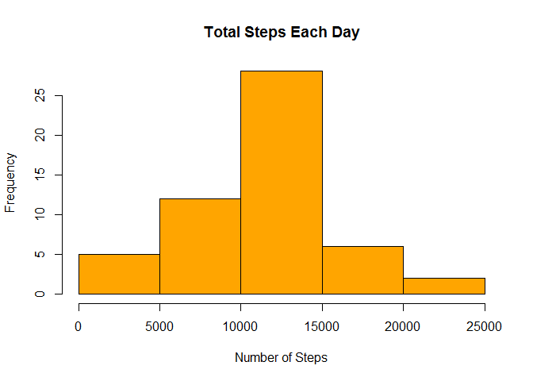
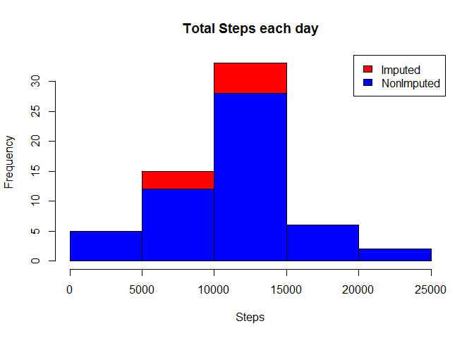
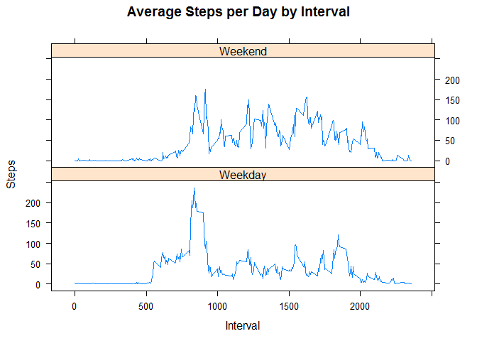

# Reproducible Research: Peer Assessment 1
Ramesh P  
April 2, 2016  
##About

This was the first project for the Reproducible Research course in Coursera's Data Science specialization track. The purpose of the project was to answer a series of questions using data collected from a FitBit.


## Loading and preprocessing the data


```r
library(ggplot2)
library(plyr)


if(!file.exists("getdata-projectfiles-UCI HAR Dataset.zip")) {
     temp <- tempfile()
     download.file("http://d396qusza40orc.cloudfront.net/repdata%2Fdata%2Factivity.zip",temp)
        unzip(temp)
        unlink(temp)
}

activity <- read.csv("activity.csv")
```

Processing Data:


```r
activity$day <- weekdays(as.Date(activity$date))
activity$DateTime<- as.POSIXct(activity$date, format="%Y-%m-%d")

##Removing NA
clean <- activity[!is.na(activity$steps),]
```

## What is mean total number of steps taken per day?

Sum steps by day using aggregate function and Plot the Histogram


```r
steps_by_day <- aggregate(steps ~ date, activity, sum)
hist(steps_by_day$steps, main = paste("Total Steps Each Day"), col="orange", xlab="Number of Steps")
```



```r
rmean <- mean(steps_by_day$steps)
rmedian <- median(steps_by_day$steps)
```

### Mean and the Median


```
FALSE [1] 10766.19
```

```
FALSE [1] 10765
```

##What is the average daily activity pattern?

1. Calculate average steps for each interval for all days.
2. Plot the Average Number Steps per Day by Interval.
3. Find interval with most average steps.


Average Steps

```
FALSE [1] 835
```

##Imputing missing value

1. Calculate and Report Missing Values


```r
nrow(activity[is.na(activity$steps),])
```

```
FALSE [1] 2304
```

2. Devise a strategy for filling in all of the missing values in the dataset. 

 my strategy is to fill up by average steps per weekday
 
 

```r
avgTable <- ddply(clean, .(interval, day), summarize, Avg = mean(steps))
nadata<- activity[is.na(activity$steps),]
Imputedata<-merge(nadata, avgTable, by=c("interval", "day"))
```

Create a new dataset that is equal to the original dataset but with the missing data filled in.


```r
## Reorder the new substituded data in the same format as clean data set
newdata2<- Imputedata[,c(6,4,1,2,5)]
colnames(newdata2)<- c("steps", "date", "interval", "day", "DateTime")
##Merge the NA averages and non NA data together
mergeData <- rbind(clean, newdata2)
```

Make a histogram of the total number of steps taken each day and Calculate and report the mean and median total number of steps taken per day. Do these values differ from the estimates from the first part of the assignment? What is the impact of imputing missing data on the estimates of the total daily number of steps?


```r
##Create sum of steps per date to compare with step 1
sumTable2 <- aggregate(mergeData$steps ~ mergeData$date, FUN=sum )
colnames(sumTable2)<- c("Date", "Steps")
## Mean of Steps with NA data taken care of
NewMean <- as.integer(mean(sumTable2$Steps))
## Median of Steps with NA data taken care of
NewMedian <- as.integer(median(sumTable2$Steps))

## Creating the histogram of total steps per day, categorized by data set to show impact
hist(sumTable2$Steps, breaks=5, xlab="Steps", main = "Total Steps each day", col="Red")
hist(steps_by_day$steps, breaks=5, xlab="steps", main = "Total Steps each day", col="Blue", add=T)
legend("topright", c("Imputed", "NonImputed"), fill=c("Red", "Blue") )
```



Mean and Median difference per day


```r
NewMean - rmean
```

```
FALSE [1] 54.81132
```

```r
NewMedian - rmedian
```

```
FALSE [1] 250
```


##Are there differences in activity patterns between weekdays and weekends?

Created a plot to compare and contrast number of steps between the week and weekend. There is a higher peak earlier on weekdays, and more overall activity on weekends.


```r
weekdays <- c("Monday", "Tuesday", "Wednesday", "Thursday", 
              "Friday")
mergeData$dow = as.factor(ifelse(is.element(weekdays(as.Date(mergeData$date)),weekdays), "Weekday", "Weekend"))

steps_by_interval_i <- aggregate(steps ~ interval + dow, mergeData, mean)

library(lattice)

xyplot(steps_by_interval_i$steps ~ steps_by_interval_i$interval|steps_by_interval_i$dow, main="Average Steps per Day by Interval",xlab="Interval", ylab="Steps",layout=c(1,2), type="l")
```




